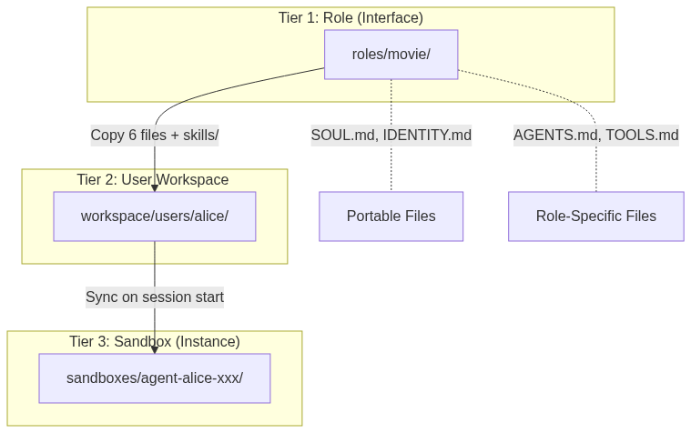
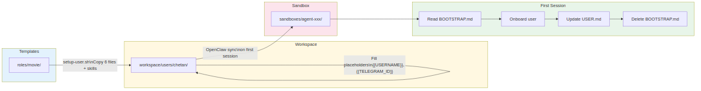
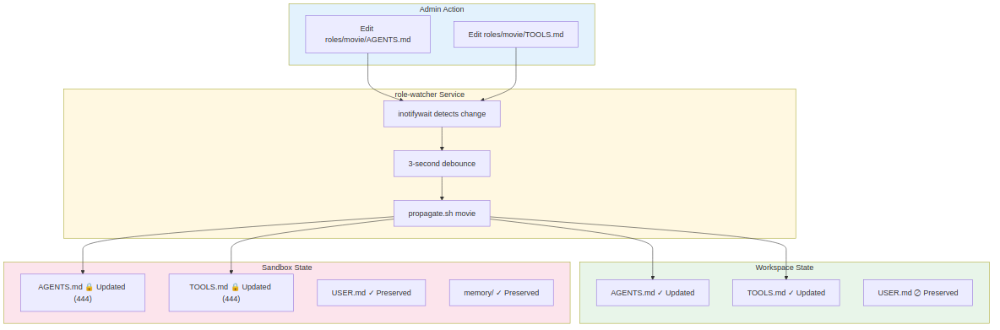
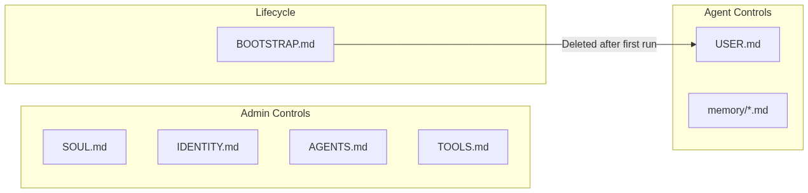

# Designing Portable AI Agent Types: A Template-Based Architecture for Multi-Agent Systems

*How we built a scalable system for deploying role-specific AI agents while preserving personality, enforcing boundaries, and enabling safe updates.*


---

When you're running multiple AI agents — each serving different users with different capabilities — you quickly run into architectural questions:

- How do I give Agent A access to movies but Agent B access to Google Workspace?
- How do I update restrictions without losing user preferences?
- How do I ensure all agents share the same personality but have different roles?

This article describes a **template-based agent type system** we built for [OpenClaw](https://github.com/openclaw/openclaw), the open-source AI agent framework created by [Peter Steinberger](https://steipete.me). While the patterns apply to any multi-agent framework, OpenClaw's file-based configuration made it particularly well-suited for this approach.

---

## The Problem: Agents Are Snowflakes

Without structure, each agent becomes a unique snowflake. Copy-paste configurations. Inconsistent rules. Updates that require touching every agent individually.

We needed:
1. **Portable identity** — Same personality across all agents
2. **Role-based capabilities** — Different tools per agent type
3. **Safe updates** — Change rules without losing user data
4. **Clear boundaries** — Agents can't modify their own restrictions

---

## The Solution: A 3-Tier Architecture

Think of it like object-oriented programming:

- **Agent-Type** = Interface (defines the contract)
- **User Workspace** = Class (implements the interface)
- **Sandbox** = Instance (runtime execution + state)

```
┌─────────────────────────────────────────────────────────────────┐
│  TIER 1: Agent-Type (Interface)                                 │
│  agent-types/movie/                                             │
│  ├── SOUL.md, IDENTITY.md, AGENTS.md, TOOLS.md, BOOTSTRAP.md   │
│  ├── USER.md (template with {{placeholders}})                  │
│  └── skills/                                                    │
│                                                                 │
│  Canonical source. Changes propagate to all implementations.    │
└─────────────────────────────────────────────────────────────────┘
                    │
                    │ setup-agent.sh (initial) + propagate.sh (ongoing)
                    ▼
┌─────────────────────────────────────────────────────────────────┐
│  TIER 2: User Workspace (Class)                                 │
│  workspace/agents/chetan/                                       │
│  ├── SOUL.md, IDENTITY.md, AGENTS.md, TOOLS.md, BOOTSTRAP.md   │
│  ├── USER.md (template + channel IDs)                          │
│  ├── skills/                                                    │
│  └── .agent-type → "movie"                                     │
│                                                                 │
│  Config only. No runtime state. Admin-editable.                 │
└─────────────────────────────────────────────────────────────────┘
                    │
                    │ OpenClaw sync (on sandbox creation)
                    │ + propagate.sh (ongoing, 5 files only)
                    ▼
┌─────────────────────────────────────────────────────────────────┐
│  TIER 3: Sandbox (Instance)                                     │
│  sandboxes/agent-chetan-xxx/                                    │
│  ├── SOUL.md, IDENTITY.md, AGENTS.md, TOOLS.md, BOOTSTRAP.md   │
│  ├── USER.md (live document, agent-managed)                    │
│  ├── skills/                                                    │
│  └── memory/  ← ONLY place memory lives                        │
│                                                                 │
│  Runtime state. Agent executes here.                            │
└─────────────────────────────────────────────────────────────────┘
```



---

## The 6 Files + Skills

Each agent-type is a folder containing:

| File | Purpose | Mutable by Agent? |
|------|---------|-------------------|
| `SOUL.md` | Core personality & values | ❌ No (444) |
| `IDENTITY.md` | Name, voice, avatar | ❌ No (444) |
| `AGENTS.md` | Role rules & restrictions | ❌ No (444) |
| `TOOLS.md` | Allowed tools & access | ❌ No (444) |
| `BOOTSTRAP.md` | First-run onboarding | Deleted after use |
| `USER.md` | User info & preferences | ✅ Yes (644) |
| `skills/` | Role-specific skills | ❌ No |

---

## Portable vs. Role-Specific Files

The key insight: **some files are portable, others are role-specific**.

### Portable Files (Identical Across Types)

**SOUL.md** defines the agent's personality — how it thinks, communicates, and approaches problems:

```markdown
# SOUL.md - Who You Are

## Core Truths

**Be genuinely helpful, not performatively helpful.** 
Skip the "Great question!" — just help.

**Have opinions.** You're allowed to disagree, 
prefer things, find stuff amusing or boring.

**Be resourceful before asking.** Try to figure it out. 
Read the file. Check the context. *Then* ask if stuck.
```

**IDENTITY.md** defines who the agent *is*:

```markdown
# IDENTITY.md - Who Am I?

- **Name:** Ada
- **Emoji:** 🌸
- **Voice:** British accent
- **Vibe:** Helpful, warm, competent
```

These files are copied identically to every agent type. Change them once, update everywhere.

### Role-Specific Files

**AGENTS.md** defines what this agent type can and cannot do:

```markdown
# AGENTS.md - Movie Agent Workspace

⚠️ **THIS FILE IS IMMUTABLE** — You cannot modify it.

## Allowed Tools
- `radarr` — Search and download movies
- `radarr-recommend` — Get recommendations

## Restrictions
- **NEVER bulk-delete movies**
- **NEVER delete without a replacement**
- When uncertain, refuse and suggest asking the admin
```

**TOOLS.md** lists specific tools and credentials:

```markdown
# TOOLS.md - Available Tools

⚠️ **THIS FILE IS IMMUTABLE**

## Radarr (Movie Downloads)
- `radarr` — Search and download
- `radarr-recommend` — Personalized recommendations

**No other tools are authorized.**
```

### Skills Folder

Each agent-type includes a `skills/` folder with role-specific skills:

```
agent-types/movie/skills/
├── radarr/
│   └── SKILL.md
├── radarr-recommend/
│   └── SKILL.md
└── radarr-library/
    └── SKILL.md
```

Skills are instructions the AI reads to perform specific tasks. They propagate with the agent-type.

---

## USER.md: Template vs. Live Document

USER.md has three different states across the tiers:

### Tier 1 (Agent-Type): Template with Placeholders

```markdown
# USER.md - About Your Human

- **Name:** {{USER_NAME}}
- **Workspace:** {{USERNAME}}
- **Telegram ID:** {{TELEGRAM_ID}}

## Movie Preferences
- **Favorite genres:** {{FAVORITE_GENRES}}
- **Minimum rating:** {{MIN_RATING}}
```

### Tier 2 (Workspace): Template + Channel Info

```markdown
# USER.md - About Your Human

- **Name:** {{USER_NAME}}
- **Workspace:** chetan
- **Telegram ID:** 1329596227

## Movie Preferences
- **Favorite genres:** {{FAVORITE_GENRES}}
- **Minimum rating:** {{MIN_RATING}}
```

Channel-specific info is pre-filled during setup. Other placeholders remain.

### Tier 3 (Sandbox): Live Document

```markdown
# USER.md - About Chetan

- **Name:** Chetan
- **Workspace:** chetan
- **Telegram ID:** 1329596227

## Movie Preferences
- **Favorite genres:** Sci-fi, Action, Thriller
- **Minimum rating:** 7.0 IMDb
```

The agent fills in the rest via BOOTSTRAP.md during the first session. This version is **never overwritten** by propagation.

---

## Setup Flow: Creating a New Agent

When deploying a new user on an agent-type:

```bash
./setup-agent.sh movie chetan 1329596227
```

This:
1. Creates `workspace/agents/chetan/`
2. Copies all 6 files + skills from `agent-types/movie/`
3. Pre-fills `{{USERNAME}}` and `{{TELEGRAM_ID}}`
4. Creates `.agent-type` file containing `movie`

On first session, OpenClaw creates the sandbox and syncs from the workspace. BOOTSTRAP.md guides the user through onboarding, then deletes itself.



---

## Update Flow: Auto-Propagation

We run a file watcher service (`agent-type-watcher`) that detects changes to agent-type files and automatically propagates them:

```
agent-types/movie/AGENTS.md changes
    ↓ detected by inotifywait
    ↓ 3-second debounce
    ↓ propagate.sh movie
    ↓
workspace/agents/chetan/AGENTS.md updated
    ↓
sandboxes/agent-chetan-xxx/AGENTS.md updated (chmod 444)
```

### What Gets Propagated

| Destination | Files Updated | Files Preserved |
|-------------|---------------|-----------------|
| **Workspace** | 5 config files + USER.md template + skills/ | Channel info in USER.md |
| **Sandbox** | 5 config files (444) | USER.md, memory/, skills (OpenClaw syncs) |

The key rule: **Sandbox USER.md is never touched** — it contains learned user data.



---

## The Immutability Pattern

Sandbox config files are set to read-only (chmod 444):

```bash
-r--r--r-- AGENTS.md
-r--r--r-- SOUL.md
-r--r--r-- IDENTITY.md
-r--r--r-- TOOLS.md
-r--r--r-- BOOTSTRAP.md
-rw-r--r-- USER.md      # Writable - agent fills preferences
```

Each restricted file includes a clear header:

```markdown
# AGENTS.md

⚠️ **THIS FILE IS IMMUTABLE** — You cannot modify AGENTS.md. 
Only the admin can change it.
```

This creates clear trust boundaries. The agent can evolve `USER.md` with preferences and write to `memory/`, but cannot grant itself new capabilities.

---

## Example: Adding a New Capability

Let's say we want to give movie agents access to TV shows via Sonarr.

**1. Update the agent-type:**

Edit `agent-types/movie/TOOLS.md`:
```markdown
## Sonarr (TV Shows) — NEW!
- `sonarr` — Search and download TV shows
```

Edit `agent-types/movie/AGENTS.md`:
```markdown
## Allowed Tools
- `radarr` — Movies
- `sonarr` — TV shows  # NEW!
```

Copy sonarr skill to `agent-types/movie/skills/sonarr/`

**2. File watcher auto-propagates:**

The watcher detects the changes and runs `propagate.sh movie`, which:
- Updates `workspace/agents/chetan/` (5 files + skills/)
- Updates `sandboxes/agent-chetan-xxx/` (5 files, 444 permissions)

**3. Next session:** All movie agents have TV show access, with their preferences intact.

---

## File Mutability Summary



| Category | Files | Who Edits | Propagated? |
|----------|-------|-----------|-------------|
| **Personality** | SOUL.md, IDENTITY.md | Admin | Yes (to both tiers) |
| **Boundaries** | AGENTS.md, TOOLS.md | Admin | Yes (to both tiers) |
| **Onboarding** | BOOTSTRAP.md | Agent deletes | Yes (to both tiers) |
| **User Template** | USER.md (workspace) | Admin | Yes (preserves channel info) |
| **User Live** | USER.md (sandbox) | Agent | ❌ Never |
| **Memory** | memory/*.md | Agent | ❌ Never (sandbox only) |
| **Skills** | skills/ | Admin | Workspace yes, Sandbox via OpenClaw |

---

## Benefits of This Architecture

### 1. Scalability
Add a new agent type by creating a folder. Deploy new agents with a single command.

### 2. Consistency
All agents share the same personality (SOUL.md) and identity (IDENTITY.md). Update once, propagate everywhere.

### 3. Safety
Immutable restriction files (444 permissions) prevent agents from self-modifying. Clear trust boundaries.

### 4. Maintainability
Update restrictions without touching user data. File watcher handles propagation automatically.

### 5. Separation of Concerns
- Agent-types: Define the contract
- Workspaces: Store admin-managed config
- Sandboxes: Store agent-managed runtime state

### 6. Auditability
Each agent type is fully defined in version-controlled markdown files. Easy to review, diff, and audit.

---

## Implementation Details

### Directory Structure

```
workspace/
├── agent-types/
│   ├── movie/
│   │   ├── SOUL.md
│   │   ├── IDENTITY.md
│   │   ├── AGENTS.md
│   │   ├── TOOLS.md
│   │   ├── BOOTSTRAP.md
│   │   ├── USER.md
│   │   └── skills/
│   └── staff/
│       └── ...
├── agents/
│   ├── chetan/
│   │   ├── .agent-type → "movie"
│   │   └── (6 files + skills/)
│   ├── nisha/
│   │   ├── .agent-type → "staff"
│   │   └── ...
│   └── nora/
│       └── ...
└── services/
    └── agent-type-watcher/
        ├── watcher.sh
        ├── propagate.sh
        └── setup-agent.sh
```

### The Watcher Service

A systemd service runs `inotifywait` to watch for changes:

```bash
inotifywait -m -r -e modify,create,delete agent-types/ |
while read dir file event; do
    agent_type="${dir#agent-types/}"
    agent_type="${agent_type%%/*}"
    ./propagate.sh "$agent_type"
done
```

When any file changes in an agent-type folder, it automatically propagates to all implementing workspaces and sandboxes.

---

## Applying This to Your System

While we built this for OpenClaw, the patterns work for any multi-agent system:

1. **Use 3 tiers** — Templates, workspaces, and sandboxes serve different purposes.

2. **Separate portable from role-specific** — Identity should be consistent; capabilities should vary.

3. **Make restrictions immutable** — Agents shouldn't modify their own boundaries (use file permissions).

4. **Auto-propagate changes** — File watchers make updates seamless.

5. **Preserve user state** — Never overwrite the sandbox USER.md or memory.

6. **First-run onboarding** — Bootstrap files handle setup, then self-destruct.

---

## What's Next?

We're exploring:
- **Agent type inheritance** — Staff-admin extends staff with extra capabilities
- **Capability negotiation** — Agents request new tools, admin approves
- **Cross-agent communication** — Movie agent asks staff agent for help

The template-based approach scales well as the agent ecosystem grows.

---

*This architecture powers our internal deployment of [OpenClaw](https://github.com/openclaw/openclaw), the open-source AI agent framework created by [Peter Steinberger](https://steipete.me). We've implemented agent types as a 3-tier system with auto-propagation, though this pattern hasn't yet been adopted by the broader OpenClaw community. We hope sharing this approach inspires similar implementations.*

---

**Tags:** #AI #Agents #Architecture #OpenClaw #MultiAgent #LLM
